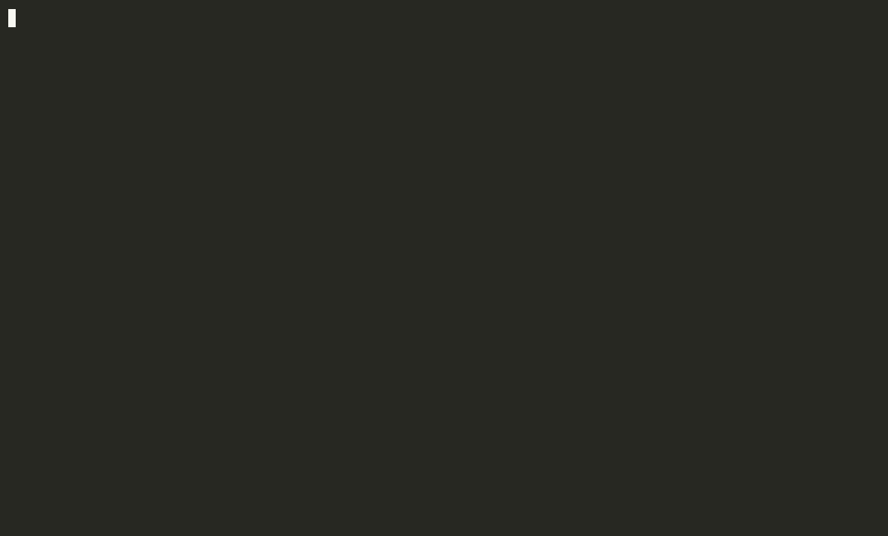

# skillcheck

[](https://github.com/icntswm/skillcheck/actions/workflows/ci.yml)
[](LICENSE)
[](https://www.npmjs.com/package/@icntswm/skillcheck)


**Regression tests for Claude Code skills.**

You edited a skill description, installed a plugin or switched models, and now
some requests load the wrong skill. Nothing warns you: the agent still
answers, just with the wrong instructions. skillcheck catches this before your
users do.



<sub>A real run on the [demo](examples/demo): one description got wider and
started taking its neighbour's requests. The free `lint` flags it, one batch
call finds both misrouted requests.</sub>

## Quick start

Needs Node 20+ and [Claude Code](https://docs.anthropic.com/en/docs/claude-code)
(`claude`) in `PATH`, logged in.

```sh
npm install -g @icntswm/skillcheck

skillcheck init               # skillcheck.yaml listing your skills; add real requests
skillcheck lint               # free static checks, no model calls
skillcheck run --batch        # cheap pre-check: one call per 25 cases
skillcheck run --only 2,5     # confirm what the batch flagged with real runs
```

| Command | What it does |
|---|---|
| `init` | starter `skillcheck.yaml` with your skill names, free |
| `gen` | the model drafts cases from your descriptions, for you to review |
| `import` | turns a skill-creator trigger eval set into cases |
| `check` | validates the file and catches misspelled or renamed skills, free |
| `lint` | short or look-alike descriptions, free |
| `list` | the skills and commands Claude Code sees, free |
| `run` | runs the cases; `--batch` for the cheap pre-check |

Every option, the default file lookup and exit codes are in
[Commands](docs/commands.md).

No cases yet? `skillcheck gen -o skillcheck.yaml` lets the model draft them from
your skill descriptions, for you to review. Coming from Anthropic's
skill-creator? `skillcheck import eval_set.json --skill <name>` converts its
trigger eval set. To try without installing: `npx @icntswm/skillcheck lint`.

## How it works

Write requests the way you actually type them, and say which skill must, or
must not, load:

```yaml
cases:
  - query: "why does TestOrderCreate fail? it was green yesterday"
    expect: [find-bug]
    forbid: [test-guard]
  - query: "what is 2 + 2?"
    none: true
```

skillcheck sends each request to a headless `claude -p`, watches which skills
the model loads, and stops the process as soon as the answer is clear. Runs go
in plan mode with edits, shell, web and MCP tools off, so your files are never
touched.

Three levels, from free to exact. Go up only when the cheaper one finds nothing:

| Command | Model calls | What it tells you |
|---|---|---|
| `skillcheck lint` | none | short or look-alike descriptions, cases that share few words with their skill |
| `skillcheck run --batch` | one per 25 cases | which skill the model *says* it would load |
| `skillcheck run` | one per case | which skill the model *actually* loads |

On the [demo](examples/demo) (six skills, twelve cases, a bad edit of two
descriptions) `lint` flagged the short description, and both `run --batch` and
`run` caught the two misrouted cases. One batch call cost $0.05–0.10 and agreed
with the full run in 34 checks out of 34.

## What you get

- 🎯 **The real routing decision**, read from Claude Code itself, not guessed from keywords.
- 💸 **You pay for the decision, not the work**: a run stops the moment a skill is picked.
- 🔍 **Points at the fix**: the confusion block shows which skill took whose requests.
- 🧪 **Honest about randomness**: `--repeat` and `threshold` tell a flaky case from a broken one.
- 🏷️ **Catches renames**: case names are checked against the skills the agent really has.
- 📄 **Plain YAML, one dependency**: cases live next to the skills they test.

## In CI

```yaml
- uses: icntswm/skillcheck@v1
  env:
    ANTHROPIC_API_KEY: ${{ secrets.ANTHROPIC_API_KEY }}
  with:
    model: sonnet
    budget: 2
```

The action tests only the skills in your repository, comments the report on the
pull request and writes JUnit, JSON and Markdown reports. `--budget` caps the
spend; `--baseline` with `--only-new-failures` compares with `main` and fails
only on new failures. Run it after you rewrite a description, add a skill that
sounds like an existing one, install a plugin, or switch models.

## Documentation

| | |
|---|---|
| [Commands](docs/commands.md) | every command and option, exit codes |
| [Writing cases](docs/writing-cases.md) | the file format, what makes a good case, `gen` and `import` |
| [Cost](docs/cost.md) | what a run costs and how to spend less |
| [Reports and CI](docs/ci.md) | confusion block, reports, GitHub Actions, comparing with `main` |
| [How it works](docs/how-it-works.md) | what happens inside a run, and the limits of each level |

## Status

Works with Claude Code; other agents with skills can be added behind a small
adapter interface. Requests can be in any language: `run` asks the model
itself. `lint` compares words, so it is tuned for English and Russian, works
roughly for other languages with spaces between words, and is of little use for
Chinese, Japanese or Korean.

## License

[MIT](LICENSE)
